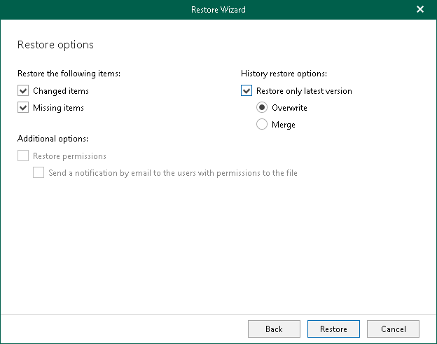

# Step 6. Specify Restore Options

At this step of the wizard, select check boxes next to the restore options that you want to apply and click Restore.

You can select the following options:

* Changed items. Allows you to restore data that has been modified in your production environment.
* Missing items. Allows you to restore missing items.

* Restore only latest version. Allows you to restore only the latest version of items. If this check box is selected, you can select one of the following options:

* Merge. To merge an existing and a backup version of items.
* Overwrite. To overwrite data in the production environment.

If the Restore only latest version check box is not selected, backed-up versions of items will be merged with the existing versions in the production environment.

