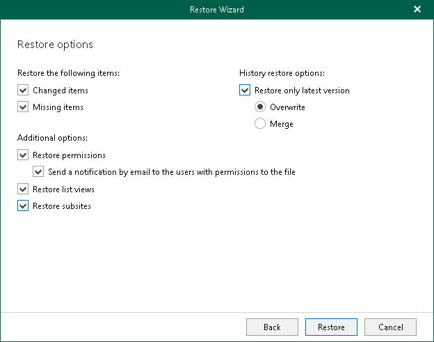

# Step 5. Specify Restore Options

At this step of the wizard, select check boxes next to the restore options that you want to apply and click Restore.

You can select the following options:

* Changed items. Allows you to restore data that has been modified in your production environment.
* Missing items. Allows you to restore missing items.
* Restore only latest version. Allows you to restore only the latest version of items. If this check box is selected, you can select one of the following options:

* Overwrite. To overwrite data in the production environment.
* Merge. To merge an existing and a backup version of items.

If the Restore only latest version check box is not selected, all versions of items in the production environment will be replaced with the relevant data from the backup file.

* Restore permissions. Allows you to restore permissions. If not selected, the permissions for the restored document library or list will be set in the following way:

* If the library (or list) does not exist on target, it will be created inheriting permissions from the parent object.
* If the library (or list) already exists on target, permissions will be preserved.

* Send a notification by email to the users with permissions to the file. Select this check box if you want to notify users about items restore. Veeam Explorer for Microsoft SharePoint will notify users with whom items have been shared. You can select this check box only if the Restore permissions check box is selected.

|  |
| --- |
| Note |
| The Send a notification by email to the users with permissions to the file check box is only available when restoring data from backups created by Veeam Backup for Microsoft 365 for Microsoft 365 organizations. |

* Restore list views. Allows you to restore your list views.
* Restore subsites. Allows you to restore your subsites.

