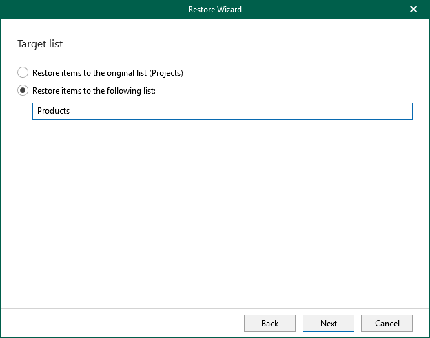

# Step 3. Specify Target List

In this article

At this step of the wizard, select whether you want to restore backed-up data to the original list or specify a custom list.

You can select one of the following options:

* Restore items to the original list. To restore the document library or list back to the original list.
* Restore items to the following list. To restore the document library or list to the specified list.

If the specified list does not exist, Veeam Explorer for Microsoft SharePoint will create it automatically.

Page updated 5/23/2025

Page content applies to build 13.0.1.1071
