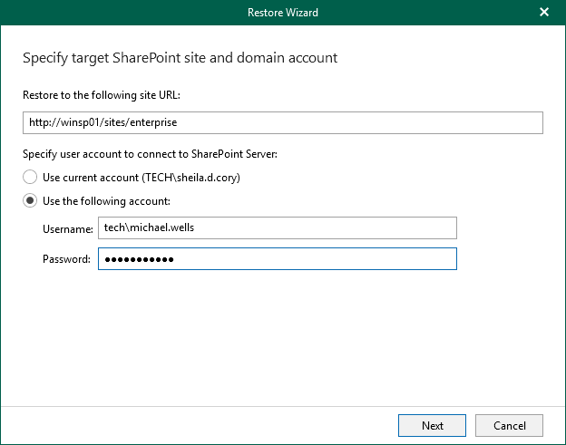

# Step 2. Specify Target Site

In this article

At this step of the wizard, specify web address of a target SharePoint site and provide credentials to connect to the Microsoft SharePoint server.

|  |
| --- |
| Note |
| Make sure that you restore to site collection that exists in the target location; Veeam Explorer for Microsoft SharePoint does not create site collections. |

To specify web address of a target site and credentials to connect to SharePoint server, do the following:

1. In the Restore to the following site URL field, specify web address of a target site.
2. In the Specify user account to connect to SharePoint Server section, use an account that you are currently logged in or provide or specify another account to connect to the Microsoft SharePoint server.

Page updated 8/21/2023

Page content applies to build 13.0.1.1071
