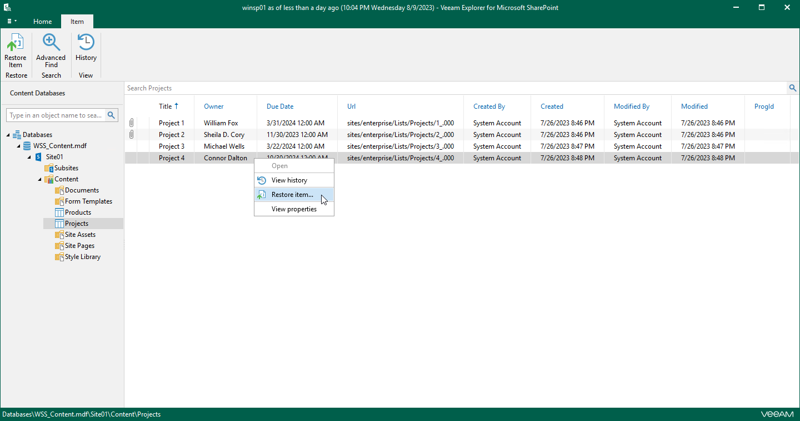

# Step 1. Launch Restore Wizard

In this article

To launch the Restore wizard for a document, do one of the following:

* In the preview pane, select a document that you want to restore, and on the Document tab, click Restore Document.

* In the preview pane, right-click a document and select Restore document.

To launch the Restore wizard for a list item, do one of the following:

* In the preview pane, select a list item that you want to restore, and on the Item tab, click Restore Item.

* In the preview pane, right-click a list item and select Restore item.

Page updated 9/18/2024

Page content applies to build 13.0.1.1071
