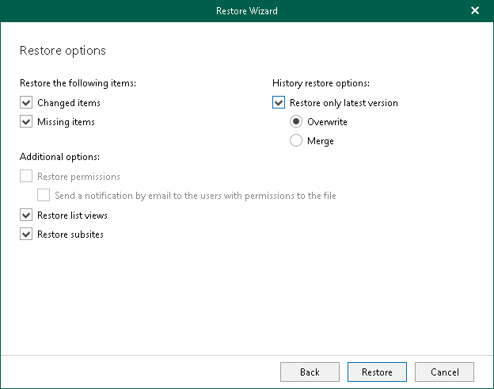

# Step 3. Specify Restore Options

At this step of the wizard, select check boxes next to the restore options that you want to apply and click Restore.

You can select the following options:

* Changed items. Allows you to restore data that has been modified in your production environment.
* Missing items. Allows you to restore missing items.
* Restore only latest version. Allows you to restore only the latest version of items:

* Overwrite. To overwrite data in the production environment.
* Merge. To merge an existing and a backup version of items.

If the Restore only latest version check box is not selected, all versions of items in the production environment will be replaced with the relevant data from the backup file.

* Restore list views. Allows you to restore your list views.
* Restore subsites. Allows you to restore your subsites.

