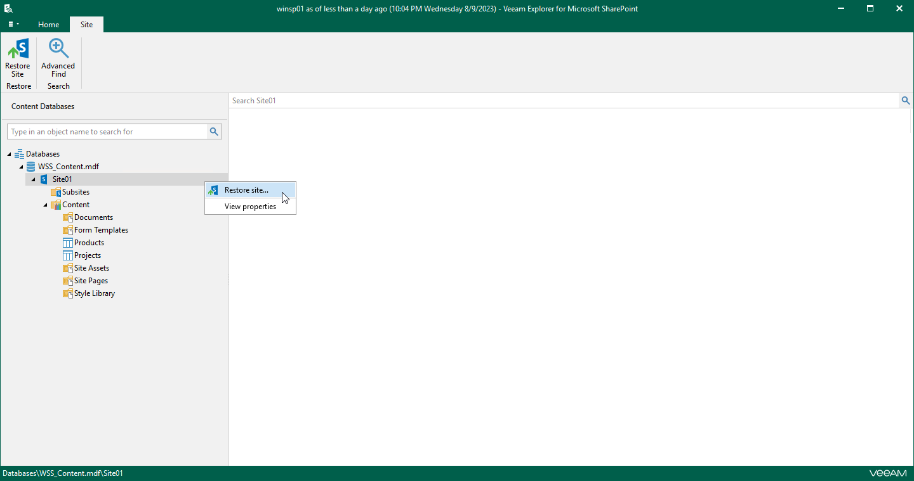

# Step 1. Launch Restore Wizard

To launch the Restore wizard, do one of the following:

* In the navigation pane, select a site that you want to restore, and on the Site tab, click Restore Site.

* In the navigation pane, right-click a site and select Restore site.

