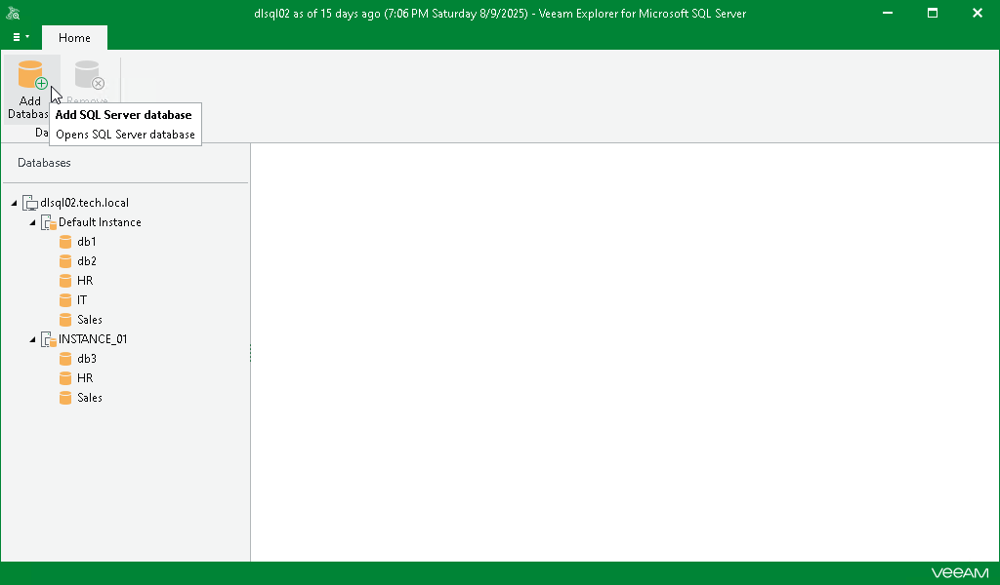
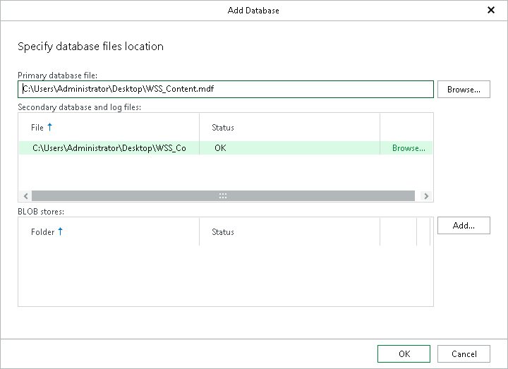

# Adding Standalone Databases

In this article

|  |
| --- |
| Note |
| Before you add a standalone Microsoft SQL database, you must configure a staging SQL server. For more information, see [Configuring Staging SQL Server](vesql_configure_staging.md). |

To add a standalone Microsoft SQL database manually, do the following:

1. On the Home tab, click Add Database.

1. Specify the location of a primary database file, a secondary database file and associated log files. If necessary, specify the BLOB store location.

Manually added databases will be displayed in the navigation pane under the Other SQL Server Databases node.

Page updated 8/25/2025

Page content applies to build 13.0.1.1071
