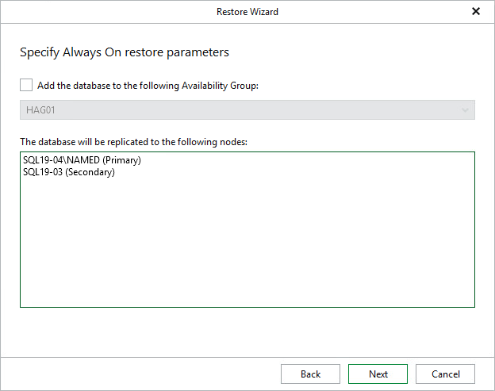

# Step 5. Specify Always On Restore Options

If the specified target Microsoft SQL Server supports Always On Availability Groups, you will be offered to specify Always On restore options. To use the Always On capabilities for the restored database, do the following:

1. Select the Add the database to the following Availability Group check box and select an availability group from the drop-down list.
2. In the The database will be replicated to the following nodes list, review information about the primary and secondary nodes of the availability group.

During the restore process, Veeam Explorer for Microsoft SQL Server will restore the database to the primary server and then replicate it to secondary nodes.

If you do not plan to use the Always On capabilities when restoring a database, clear the Add the database to the following Availability Group check box.

