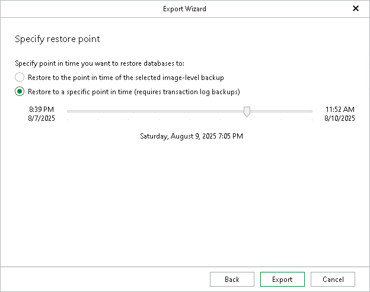

# Step 3. Specify Restore Point

In this article

At this step of the wizard, select a state as of which you want to restore your database.

1. Choose a restore point:

* Select the Restore to the point in time of the selected image-level backup option to load database files as of the moment when the current restore point was created by the backup or replication job.

* Select the Restore to a specific point in time option to load database files as of the specified point in time.

Use the slider to choose the point in time you need.

1. Click Export.

|  |
| --- |
| Note |
| The Perform restore to the specific transaction option is unavailable when exporting multiple databases. |

Page updated 11/26/2024

Page content applies to build 13.0.1.1071
