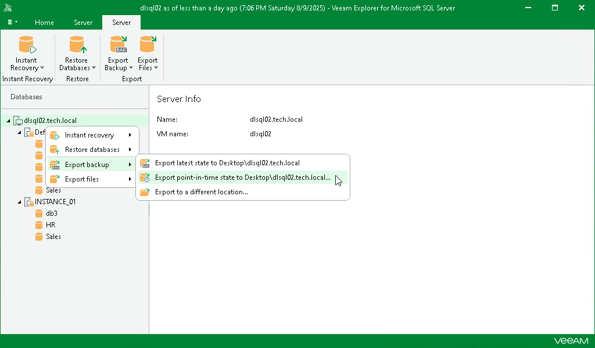

# Step 1. Launch Export Wizard

In this article

To launch the Export wizard, do the following:

1. In the navigation pane, select an instance or the server.
2. On the Instance or Server tab, select Export Backup > Export point-in-time state to Desktop\<server\_name>.

Alternatively, you can right-click an instance or the server and select Export backup > Export point-in-time state to Desktop\<server\_name>.

Page updated 12/18/2024

Page content applies to build 13.0.1.1071
