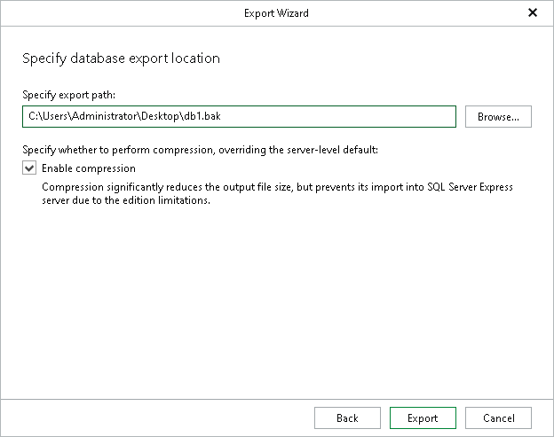

# Step 4. Specify Export Location

At this step of the wizard, specify the path to the destination directory and click Export. Click Browse to manually select the destination folder from the directory structure of the target server.

You can select the Enable compression check box to reduce the output file size.

|  |
| --- |
| Note |
| Consider the following:   * The account you are using must have a sufficient permission level to access the selected directory (Read and Write as minimum recommended). * Compression is unavailable if the staging SQL server runs any Express Edition of Microsoft SQL Server. |

