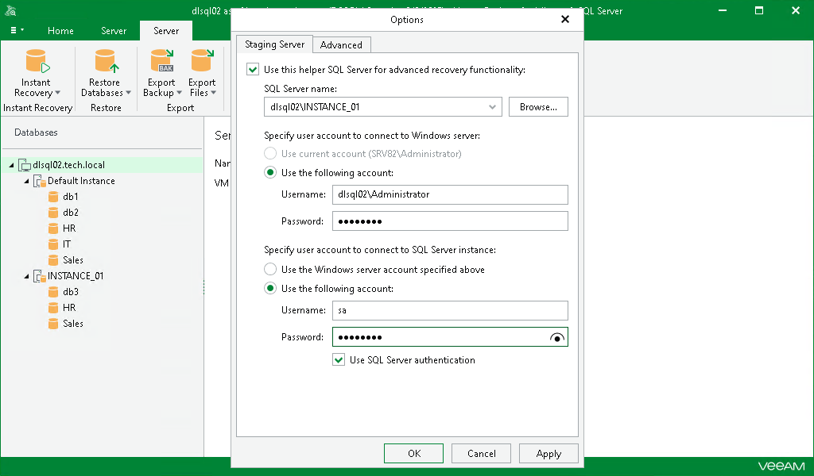

# Configuring Staging SQL Server

In this article

To enable advanced recovery functionality, you can use a Microsoft SQL Server machine as a staging server. This section explains the use cases of the staging server and how to configure it.

A staging server is required in the following cases:

* When you export Microsoft SQL Server databases, as described in [Data Export](vesql_data_export.md).
* When you restore, publish, and instantly recover your data to a specific transaction. For example, see [Fine-Tune Restore Point](vesql_fine_tune_pit.md).
* When you restore database schema and data, as described in [Restoring Database Schema and Data](vesql_restoring_schema.md).
* When you add standalone Microsoft SQL Server databases to Veeam Explorer for Microsoft SQL Server, as described in [Adding Standalone Databases](vesql_add_database.md).

A machine used as a staging server can reside in the same domain as the machine hosting Veeam Explorer for Microsoft SQL Server, as well as in a trusted domain or untrusted domain.

For the add standalone database operation, consider the following:

* A machine used as a staging server can reside in the same domain as the machine hosting Veeam Explorer for Microsoft SQL Server or in a trusted domain. You cannot use a staging server that belongs to an untrusted domain to add a standalone database to Veeam Explorer for Microsoft SQL Server.
* Both Windows authentication and SQL Server authentication methods are supported for the staging server. If you want to use Windows authentication, complete the following steps to configure delegation settings:

1. In Active Directory Users and Computers, select the staging server.
2. Open server properties and go to the Delegation tab. Select the Trust this computer for delegation to specified services only and Use any authentication protocol options for the cifs service on a computer with Veeam Explorer for Microsoft SQL Server.
3. Restart the staging server.
4. Select a domain user account that you want to use when connecting to the staging server and make sure the Account is sensitive and cannot be delegated check box is not selected.

To configure a staging server, do the following:

1. In the Veeam Explorer for Microsoft SQL Server main menu, click General Options.
2. On the Staging Server tab, select the Use this helper SQL Server for advanced recovery functionality check box and do the following:

1. From the SQL Server name drop-down list, select an instance that you want to use as your staging server.

You can click Browse to locate an instance using the built-in browser, as described in [Browsing for Servers](#bfs).

1. In the Specify user account to connect to Windows server section, select one of the following options:

* Use current account. To connect to the specified server using the current user account under which Veeam Explorer for Microsoft SQL Server is running.
* Use the following account. To connect to the specified server under a custom user account.

When using a custom account, in the Username field, specify a user name and in the Password field, provide the password.

1. In the Specify user account to connect to SQL Server instance section, select one of the following options:

* Use the Windows server account specified above. To connect to the specified instance under the user account that you have specified in the Specify user account to connect to Windows server section.
* Use the following account. To connect to the specified instance under a custom user account.

When using a custom account, in the Username field, specify a user name and in the Password field, provide the password.

To use SQL Server authentication, select the Use SQL Server authentication check box.

1. Click OK to finish the configuration and close the window.

Browsing for Servers

To browse for a Microsoft SQL Server instance, perform one of the following actions:

* On the Local Servers tab, choose a Microsoft SQL Server instance that is located on the machine where Veeam Explorer for Microsoft SQL Server is opened and click Select.
* On the Network Servers tab, choose a Microsoft SQL Server instance available over the network and click Select.

Page updated 8/15/2024

Page content applies to build 13.0.1.1071
