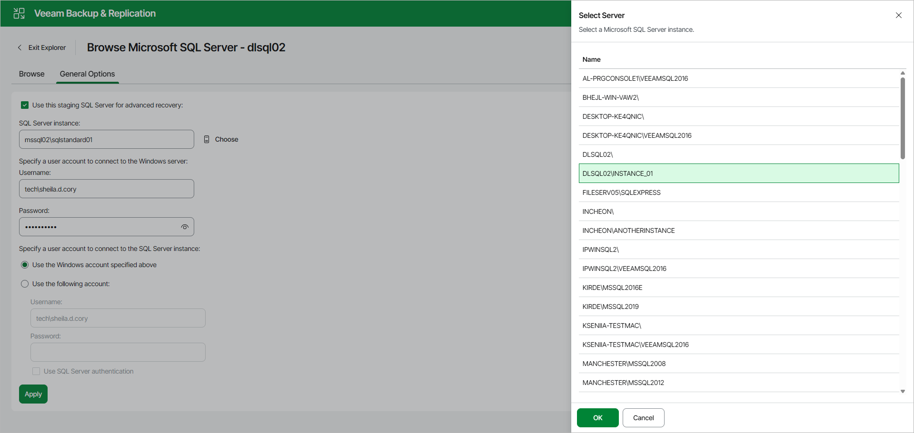
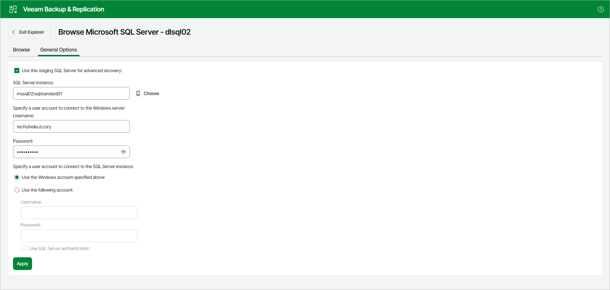

# Configuring Staging SQL Server

To enable advanced recovery functionality, you can use a Microsoft SQL Server machine as a staging server. This section explains the use cases for the staging server, the required prerequisites and how to add it in Veeam Explorer for Microsoft SQL Server.

Use Cases

A staging server is required in the following cases:

* When you export Microsoft SQL Server databases, as described in the [Data Export](vesql_data_export_web_ui.md) section.
* When you restore, publish, and instantly recover your data to a specific transaction. For example, see [Fine-Tune Restore Point](vesql_restore_web_ui_single_pit_fine_tune.md).

Considerations and Limitations

Before you add a staging server, consider the following:

* As a staging server, you can use any edition of Microsoft SQL Server, including the Express Edition. You can download the necessary edition from the [Microsoft Download Center](https://www.microsoft.com/en-us/download).

Note that databases that exceed 10 GB cannot be attached to a Microsoft SQL Server Express Edition instance due to Express Edition limitations. For more information, see the [Editions and supported features of SQL Server 2022](https://learn.microsoft.com/en-us/sql/sql-server/editions-and-components-of-sql-server-2022?view=sql-server-ver16) Microsoft article.

* Make sure that the staging server has the same version of Microsoft SQL Server as the source server, or a later version.
* A SQL Server included in Microsoft SQL Server failover cluster cannot be used as a staging system.

* Using Availability Group Listeners as staging servers is not recommended.

* A staging server can reside in the same domain as the mount server, as well as in a trusted domain or untrusted domain.

Add Staging Server

To add the staging server, do the following:

1. In the Veeam Explorer for Microsoft SQL Server web UI, open the General Options tab.
2. Select the Use this staging SQL Server for advanced recovery check box and do the following:

1. In the SQL Server instance field, specify the instance that you want to use as your staging server.

You can click Choose to open the Select Server window and browse through the list of instances available over the network.

Select a Microsoft SQL Server instance to use as a staging server and click OK.

1. In the Specify a user account to connect to the Windows server section, in the Username and Password fields, specify the credentials to connect to the Windows server.

1. In the Specify a user account to connect to the SQL Server instance section, select one of the following options:

* Use the Windows account specified above. To connect to the specified instance under the user account that you have specified in the Specify a user account to connect to the Windows server section.
* Use the following account. To connect to the specified instance under a custom user account.

When using a custom account, in the Username field, specify a user name and in the Password field, provide the password.

To use SQL Server authentication, select the Use SQL Server authentication check box.

1. Click Apply to save the configuration.

Page updated 2026-07-09

