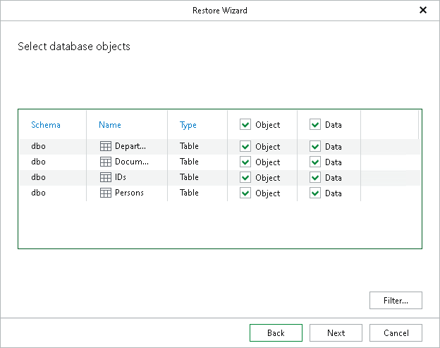

# Step 5. Select Database Objects

At this step of the wizard, specify database objects you want to restore.

Use the Object and Data check boxes to specify what database objects and data should be restored.

To display only specific objects, click Filter and select the object type.

