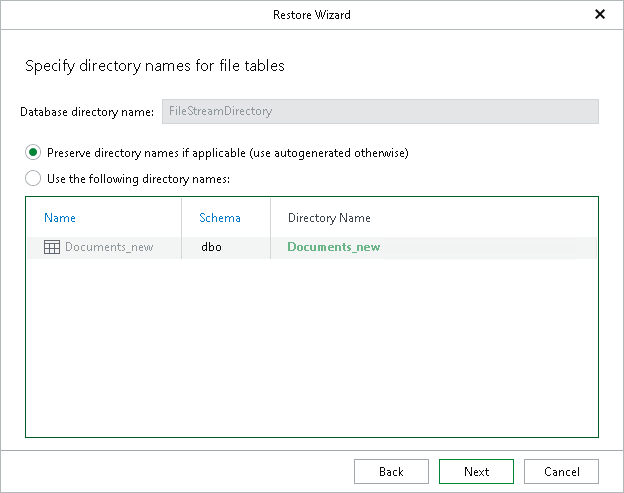

# Step 7. Specify Directory Names for File Tables

In this article

At this step of the wizard, specify directory names for file tables.

The following options are available:

* Preserve directory names if applicable (use autogenerated otherwise).

To use the original names.

If such names already exist on a target server, Veeam Explorer for Microsoft SQL Server will add \_new suffix to each name. For example, <existing\_name>\_new.

* Use the following directory names.

To provide a different name under the Directory Name column.

Page updated 8/24/2025

Page content applies to build 13.0.1.1071
