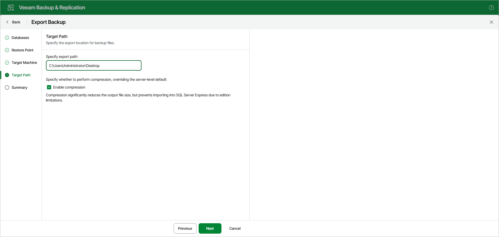

# Step 5. Specify Export Location

At the Target Path step, specify the path to the destination directory on the target server.

You can select the Enable compression check box to reduce the output file size.

|  |
| --- |
| Note |
| Consider the following:   * The account you are using must have a sufficient permission level to access the selected directory (Read and Write as minimum recommended). * Compression is unavailable if the staging SQL server runs any Express Edition of Microsoft SQL Server. |

Page updated 2026-07-07

