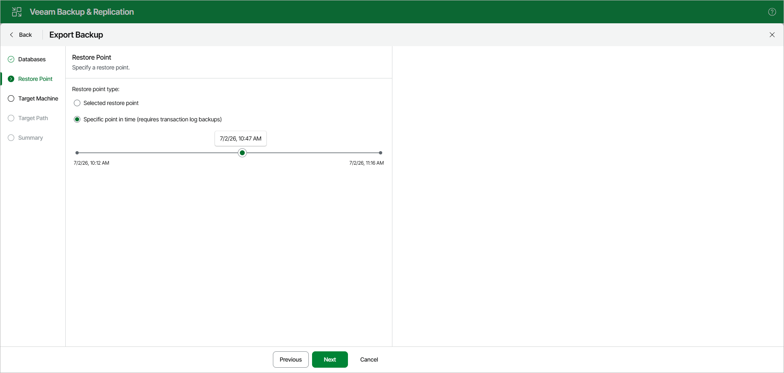

# Step 3. Specify Restore Point

At the Restore Point step, select a state as of which you want to export your databases:

* Select the Selected restore point option to load data as of the moment when the current restore point was created by the backup or replication job.

* Select the Specific point in time option to load data as of the specified point in time. Use the slider to choose the point in time you need.

Note that this option is available only if transaction log backups exist. For more information, see [Required Job Settings](vesql_bu_job_settings.md).

If the backed-up transaction logs do not contain information about some databases for the selected point in time, those databases will be recovered as of their latest available state.

|  |
| --- |
| Note |
| The Restore to specific transaction option is unavailable when exporting multiple databases. |

Page updated 2026-07-07

