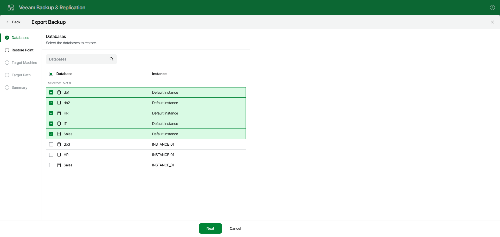

# Step 2. Select Databases

At the Databases step, select the databases that you want to export.

To quickly find the necessary databases, use the search field or sort the databases by name. If the databases belong to multiple instances, you can also sort the databases by instance name.

Page updated 2026-07-07

