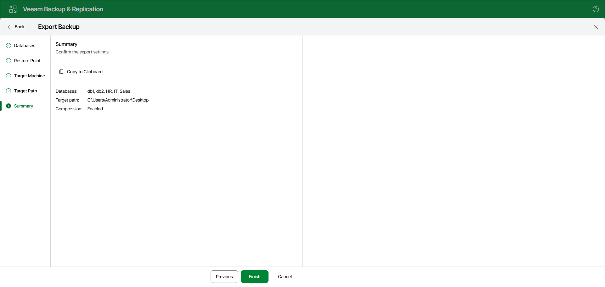

# Step 6. Review Export Summary

At the Summary step, review the export settings. To copy the summary to the clipboard, click Copy to Clipboard. To start the export, click Finish.

Page updated 2026-07-07

