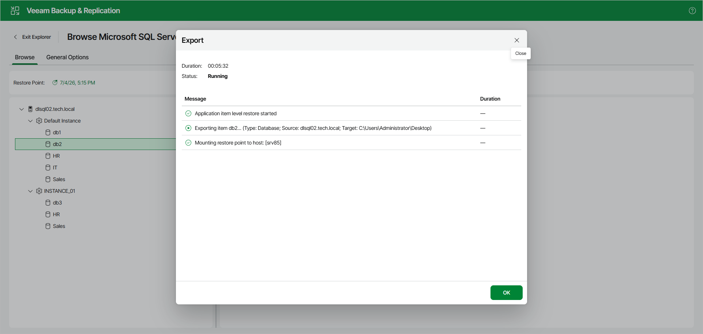
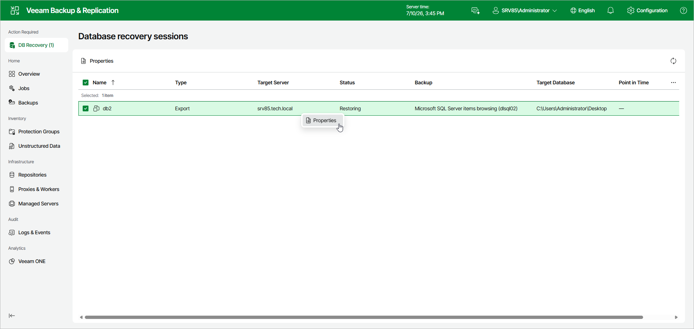

# Viewing Export Session

After you finish the steps of the Export wizard, Veeam Explorer for Microsoft SQL Server starts an export session that shows the progress of the operation.

Note that clicking OK or closing the session window does not interrupt the operation.

You can manage and track the session progress in the Veeam Backup & Replication web UI.

To do this, open the Veeam Backup & Replication web UI and in the management pane, click DB Recovery.

In the Database recovery sessions view, you can find ongoing recovery sessions.

To see details about the export session, do the following:

1. In the Database recovery sessions view, select an export session.
2. Click Properties.

Alternatively, you can right-click the session and click Properties.

Page updated 2026-07-10

