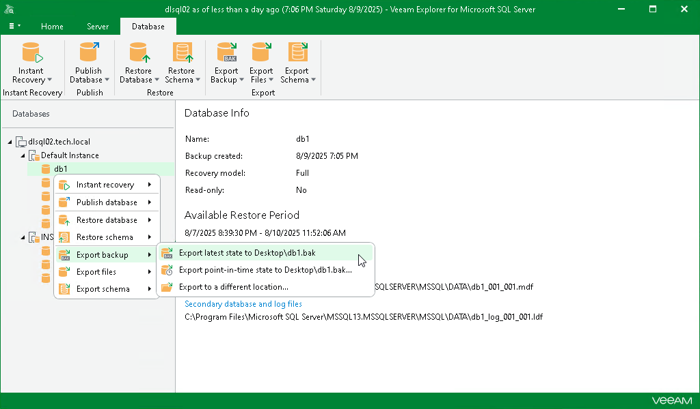

# Exporting Latest State

In this article

To export data as of the latest available state to the default location, do the following:

1. In the navigation pane, select a database.
2. On the Database tab, select Export Backup > Export latest state to Desktop\<db\_name>.bak.

Alternatively, you can right-click a database and select Export backup > Export latest state to Desktop\<db\_name>.bak.

|  |
| --- |
| Note |
| The name of the export option depends on the restore point you select during the [application item restore](restore_veeam_explorers.md) process in the Veeam Backup & Replication console.   * If you select the most recent available restore point, the option name is displayed as Export latest state to Desktop\<db\_name>.bak. * If you select any other restore point, the option name is displayed as Export state of <point\_in\_time> to Desktop\<db\_name>.bak. |

After the export process is complete, review the results shown in the Databases export summary window. To do this, click See more to expand the window and review details of the export operation.

You can filter notifications by their status: Error, Warning or Success.

Page updated 11/12/2025

Page content applies to build 13.0.1.1071
