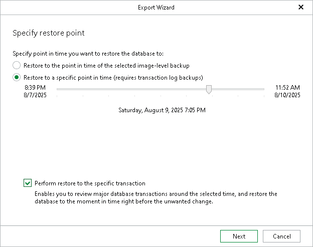

# Step 2. Specify Restore Point

In this article

At this step of the wizard, select a state as of which you want to restore your data:

* Select the Restore to the point in time of the selected image-level backup option to load data as of the moment when the current restore point was created.

* Select the Restore to a specific point in time option to load data as of the selected point in time.

Use the slider to choose the point in time you need.

* Select the Perform restore to the specific transaction check box to load data exactly as of the moment before undesired transactions.

|  |
| --- |
| Note |
| The Perform restore to the specific transaction option requires a staging SQL server. For more information, see [Configuring Staging SQL Server](vesql_configure_staging.md). |

Page updated 10/6/2025

Page content applies to build 13.0.1.1071
