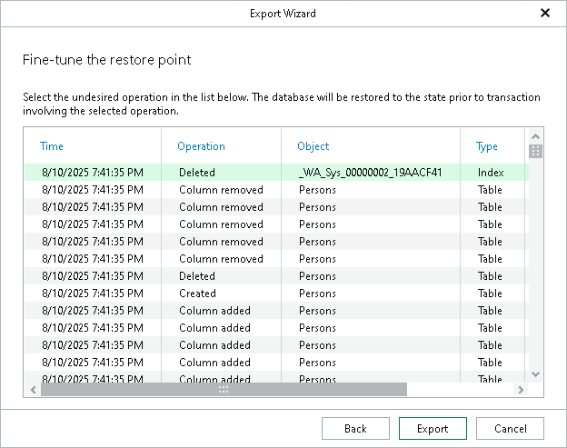

# Step 3. Fine-Tune Restore Point

At this step of the wizard, select an operation prior to which you want to export your database and click Export.

Veeam Explorer for Microsoft SQL Server database operations are listed in the [SQL Server Database Operations](vesql_operations.md) section.

|  |
| --- |
| Note |
| This step is available only if you have selected the Perform restore to the specific transaction check box at the previous step. |

