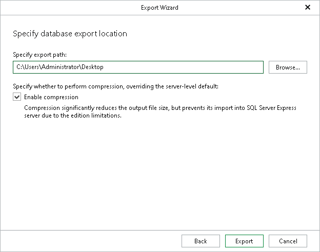

# Step 4. Specify Export Location

In this article

At this step of the wizard, specify the path to the destination directory and click Export.

You can select Enable compression check box to reduce the file size.

|  |
| --- |
| Note |
| Compression is unavailable if the staging SQL server runs any Express Edition of Microsoft SQL Server. |

Page updated 8/10/2025

Page content applies to build 13.0.1.1071
