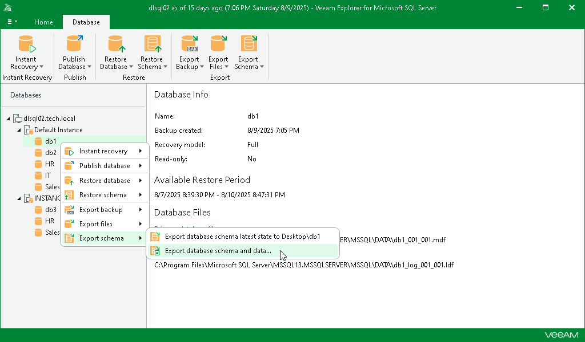

# Step 1. Launch Export Wizard

To launch the Export wizard, do the following:

1. In the navigation pane, select a database.
2. On the Database tab, select Export Schema > Export database schema and data.

Alternatively, you can right-click a database and select Export schema > Export database schema and data.

|  |
| --- |
| Tip |
| To import data tables, use the standard SQL server bcp.exe utility. For more information, see [this Microsoft article](https://msdn.microsoft.com/en-us/library/aa337544%28v%3Dsql.120%29.aspx). |

