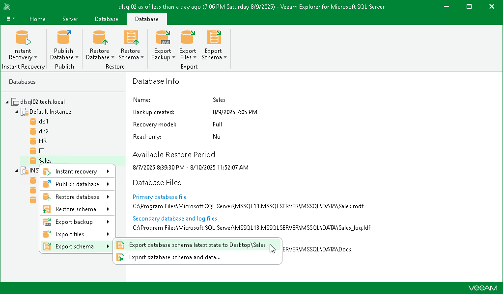
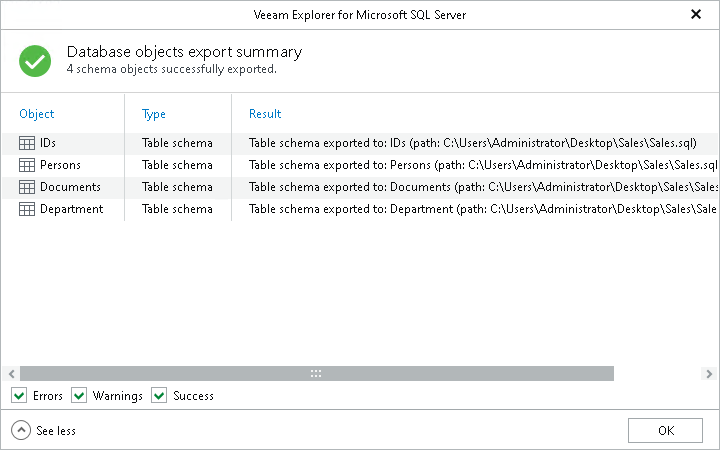

# Using 1-Click Export

Veeam Explorer for Microsoft SQL Server allows you to quickly export the database schema state as of the current restore point.

To export database schema to the default location, do the following:

1. In the navigation pane, select a database.
2. On the Database tab, select Export Schema > Export database schema latest state to Desktop\<db\_name>.

Alternatively, you can right-click a database and select Export schema > Export database schema latest state to Desktop\<db\_name>.

|  |
| --- |
| Note |
| The name of the export option depends on the restore point you select during the [application item restore](restore_veeam_explorers.md) process in the Veeam Backup & Replication console.   * If you select the most recent available restore point, the option name is displayed as Export database schema latest state to Desktop\<db\_name>. * If you select any other restore point, the option name is displayed as Export database schema state of <point\_in\_time> to Desktop\<db\_name>. |

After the export process is complete, review the results shown in the Databases export summary window. To do this, click See more to expand the window and review details of the export operation.

You can filter notifications by their status: Error, Warning or Success.

