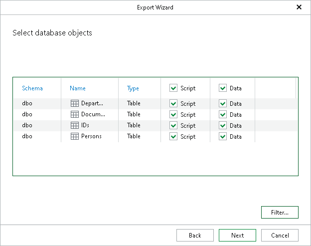

# Step 4. Select Database Objects

At this step of the wizard, select database objects to restore.

To display only specific objects, click Filter and select an object type you want to be shown in the list.

