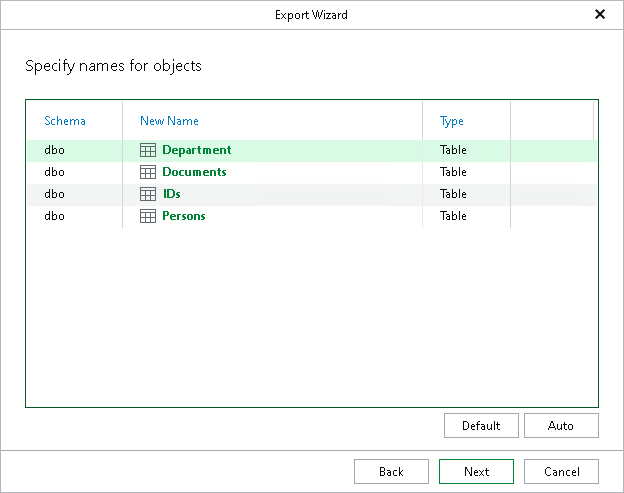

# Step 5. Specify Names for Objects

At this step of the wizard, specify the name to be assigned to the object.

* To specify a new name, select a database and provide a new name.
* To assign a default name with the \_new suffix, click Auto.

