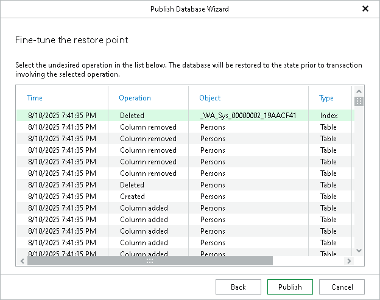

# Step 3. Fine-Tune Restore Point

At this step of the wizard, select an operation prior to which you want to publish your database and click Publish.

Veeam Explorer for Microsoft SQL Server database operations are listed in the [SQL Server Database Operations](vesql_operations.md) section.

|  |
| --- |
| Note |
| This step is available only if you have selected the Perform restore to the specific transaction check box at the [Specify Restore Point](vesql_specify_restore_pointpublish_pit.md) step of the wizard. |

