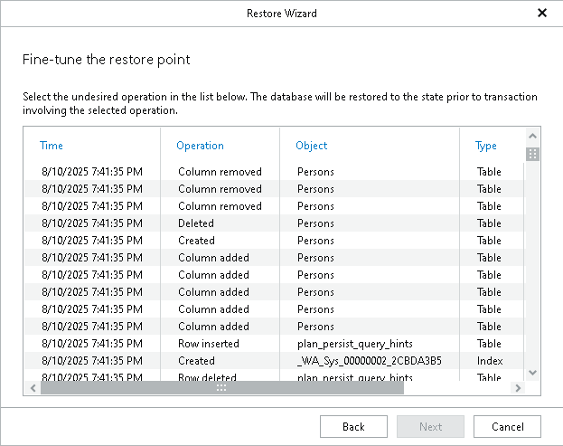

# Step 3. Fine-Tune Restore Point

In this article

At this step of the wizard, select an operation prior to which you want to recover your database.

Veeam Explorer for Microsoft SQL Server database operations are listed in the [SQL Server Database Operations](vesql_operations.md) section.

|  |
| --- |
| Note |
| This step is available only if you have selected the Perform restore to the specific transaction check box at the [Specify Restore Point](vesql_restore_point_single.md) step of the wizard. |

Page updated 8/12/2025

Page content applies to build 13.0.1.1071
