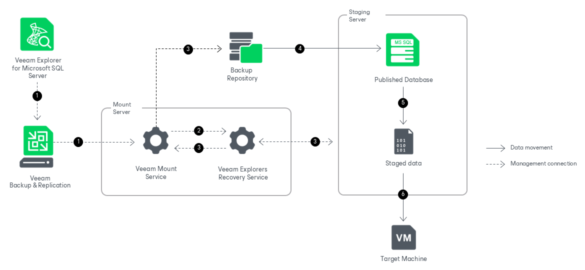

# How Export Works

Veeam Explorer for Microsoft SQL Server allows you to export databases to any Windows machine. You can export your database as database files (MDF and LDF files) or as a BAK file.

Exporting databases with Veeam Explorer for Microsoft SQL Server works in the following manner:

1. To start the export process, Veeam Explorer for Microsoft Active Directory sends a restore command to the Veeam Mount Service. The service runs on the mount server associated with the backup repository.
2. The Veeam Mount Service delegates this request to the Veeam Explorers Recovery Service running on the same server.
3. The Veeam Explorers Recovery Service connects to the staging server and performs a series of validations. For example, it checks if the staging server has enough free space for the staged data. The Veeam Explorers Recovery Service sends a request to the Veeam Mount Service to connect to the backup repository and initiate the mounting operation.

Veeam Explorer for Microsoft SQL Server deploys persistent or runtime components on the staging server, which check the valid rights assignments required for export, get information about the databases, and later perform required file operations. For more information on how these components are deployed, see [Deploying Persistent and Non-Persistent Components](vesql_restore_service_web_ui.md).

The Veeam Explorers Recovery Service sends a request to the Veeam Mount Service to connect to the backup repository and initiate the mounting operation.

1. The Veeam Mount Service mounts the necessary file system to the C:\VeeamFLR directory on the staging Microsoft SQL Server machine. For more information, see [How Mounting Works](vesql_mount_operations_web_ui.md).
2. The persistent or runtime components save data from the mounted file system to the C:\Windows\TEMP directory on the staging Microsoft SQL Server machine. This step helps convert the data into the necessary format before data transfer.
3. The persistent or runtime components send the staged data to the target Windows machine. Data transfer is established by data movers running on the staging server and the target Windows machine.

After the export operation successfully completes, Veeam Explorer for Microsoft SQL Server unmounts the mounted file system and removes the staged data from the staging server.

Page updated 2026-07-07

