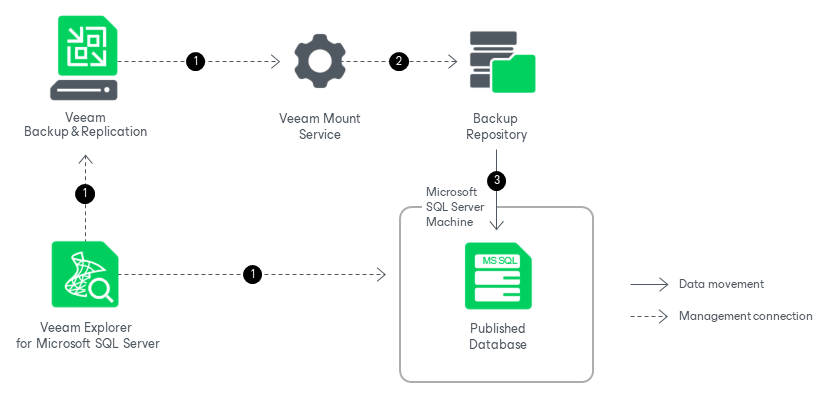

# How Publishing Works

In this article

Publishing databases with Veeam Explorer for Microsoft SQL Server works in the following manner:

1. Veeam Explorer for Microsoft SQL Server connects to the Veeam Mount Service and the target server and performs a series of validations. For example, it check if the database exists on the target server.

To perform these validations and required file operations, Veeam Explorer for Microsoft SQL Server deploys persistent or runtime components on the target server and, if you publish your data up to a specific transaction, on the staging server. These components check the valid rights assignments required for database recovery, get information about the databases, and later perform the required database operations. For more information, see [Deploying Persistent and Non-Persistent Components](vesql_restore_service.md).

1. Veeam Explorer for Microsoft SQL Server sends a publishing command to the Veeam Mount Service running on the mount server associated with the backup repository. The service connects to the backup repository and prepares the mounting operation.
2. The Veeam Mount Service mounts the necessary file system to the C:\VeeamFLR directory on the target Microsoft SQL Server machine. For more information, see [How Mounting Works](vesql_mount_operations.md).

When publishing to a failover cluster, the file system is mounted to the C:\VeeamFLR directory of every node of the cluster. Note that each volume is also mounted as a separate drive, requiring a free drive letter.

The persistent or runtime components open the database from the mounted file system, so that you can perform the required operations with Microsoft SQL Server tools.

All changes to the database that occur after publishing are saved in the publishing write cache, stored on the mount server. By default, the write cache is stored in the C:\ProgramData\Veeam\Backup\IRCache\ folder of the mount server. For more information on how to configure the write cache folder, see [Specify Mount Server Settings](repository_mount_server.md).

Once the publishing operation is completed, you can export the modified database as a BAK file. For more information, see [Exporting as BAK](vesql_published_export.md).

After you have finished working with the published database, you can unpublish (detach) the database from the target Microsoft SQL Server machine. For more information, see [Unpublishing Databases](vesql_unpublishing.md).

Page updated 11/3/2025

Page content applies to build 13.0.1.1071
