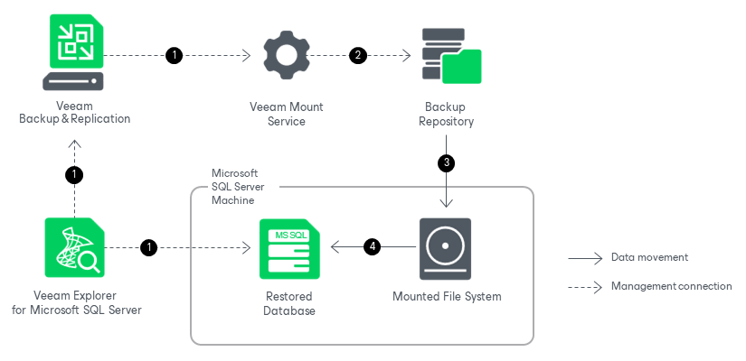
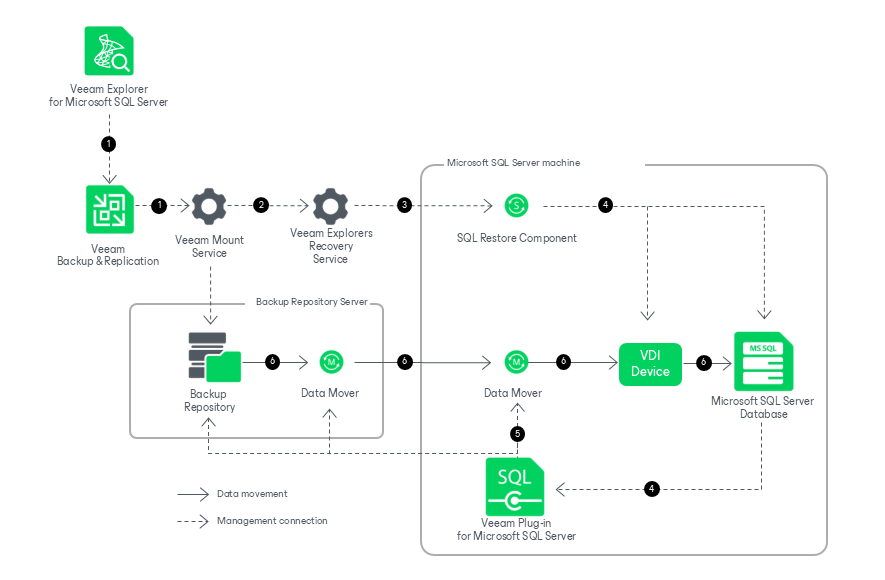

# How Restore Works

In this article

Restore from Image-Level Backups

Restoring databases with Veeam Explorer for Microsoft SQL Server works in the following manner:

1. Veeam Explorer for Microsoft SQL Server connects to the target server and performs a series of validations. For example, it checks if the database exists on the target server and if the target server has enough free space for the restored database.

To perform these validations and required file operations, Veeam Explorer for Microsoft SQL Server deploys persistent or runtime components on the target server and, if you restore your data up to a specific transaction, on the staging server. These components check the valid rights assignments required for database recovery, get information about the databases, and later perform required file operations including database and transaction logs copy. For more information, see [Deploying Persistent and Non-Persistent Components](vesql_restore_service.md).

1. Veeam Explorer for Microsoft SQL Server sends a restore command to the Veeam Mount Service running on the mount server associated with the backup repository. The service connects to the backup repository and prepares the mounting operation.
2. The Veeam Mount Service mounts the necessary file system to the C:\VeeamFLR directory on the target Microsoft SQL Server machine. For more information, see [How Mounting Works](vesql_mount_operations.md).
3. The persistent or runtime components copy the database files and the transaction log backups from the mounted file system to the native file system of the target machine and start the restored database.

After the restore operation successfully completes, Veeam Explorer for Microsoft SQL Server unmounts the mounted file system from the target server.

Restore from SQL Plug-in Backups

Restoring from backups created with Veeam Plug-In for Microsoft SQL Server works in the following manner:

1. To start the restore process, Veeam Explorer for Microsoft SQL Server sends a restore command to the Veeam Mount Service running on the mount server associated with the backup repository.
2. The Veeam Mount Service delegates this request to the Veeam Explorers Recovery Service running on the same server.
3. The Veeam Explorers Recovery Service deploys a restore component on the target  server. For more information about persistent and non-persistent components used during restore, see [Deploying Persistent and Non-Persistent Components](vesql_restore_service.md).
4. On the target server, the restore component checks if the database exists on the target server, the valid rights assignments required for database recovery and if the target server has enough free space for the restored database. The restore component also connects to Veeam Plug-In for Microsoft SQL Server.

For each database that will be restored, the restore component creates a VDI device — a virtual device that impersonates itself as backup storage and communicates with Microsoft SQL Server.

1. Veeam Plug-In for Microsoft SQL Server retrieves data from the backups stored in the backup repository and starts Veeam Data Mover services on the backup repository and the target Microsoft SQL Server machine.
2. Veeam Data Movers transport the Microsoft SQL Server data from the backup repository to the VDI devices on the target server. The restore component on the target server applies the changes to the relevant databases.

Page updated 11/12/2025

Page content applies to build 13.0.1.1071
