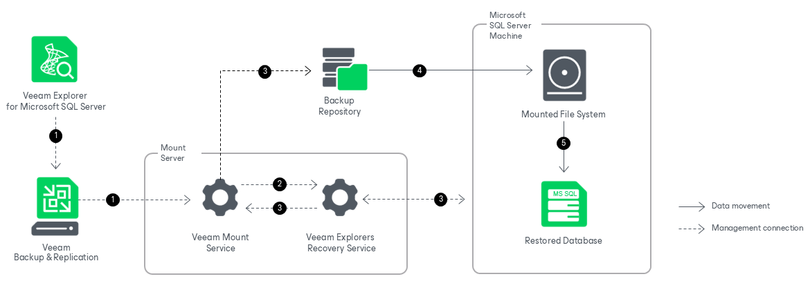

# How Restore Works

Restore from Image-Level Backups

Restoring databases with the Veeam Explorer for Microsoft SQL Server web UI works in the following manner:

1. To start the restore process, Veeam Explorer for Microsoft SQL Server sends a restore command to the Veeam Mount Service. The service runs on the mount server associated with the backup repository.
2. The Veeam Mount Service delegates this request to the Veeam Explorers Recovery Service running on the same server.

1. The Veeam Explorers Recovery Service connects to the target server and performs a series of validations. For example, it checks if the database exists on the target server and if the target server has enough free space for the restored database.

To perform these validations and required file operations, the Veeam Explorers Recovery Service deploys persistent or runtime components on the target server and, if you restore your data up to a specific transaction, on the staging server. These components check the valid rights assignments required for database recovery, get information about the databases, and later perform required file operations including database and transaction logs copy. For more information, see [Deploying Persistent and Non-Persistent Components](vesql_restore_service_web_ui.md).

The Veeam Explorers Recovery Service sends a request to the Veeam Mount Service to connect to the backup repository and initiate the mounting operation.

1. The Veeam Mount Service mounts the necessary file system to the C:\VeeamFLR directory on the target Microsoft SQL Server machine. For more information, see [How Mounting Works](vesql_mount_operations_web_ui.md).
2. The persistent or runtime components copy the database files and the transaction log backups from the mounted file system to the native file system of the target machine and start the restored database.

After the restore operation successfully completes, Veeam Explorer for Microsoft SQL Server unmounts the mounted file system from the target server.

Page updated 2026-07-07

