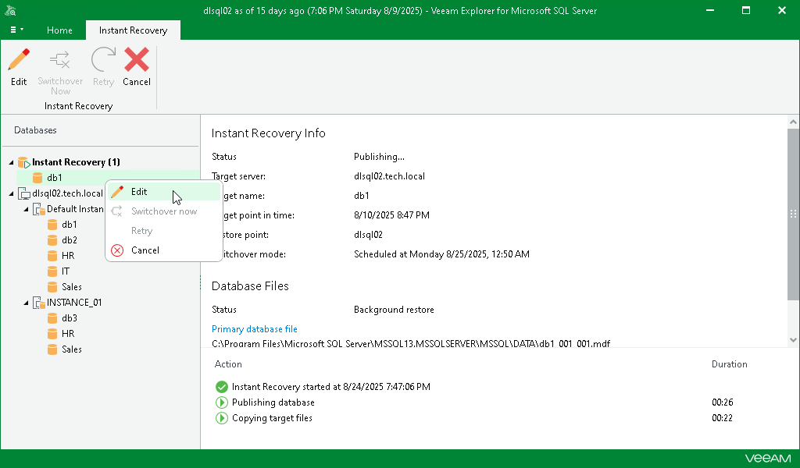
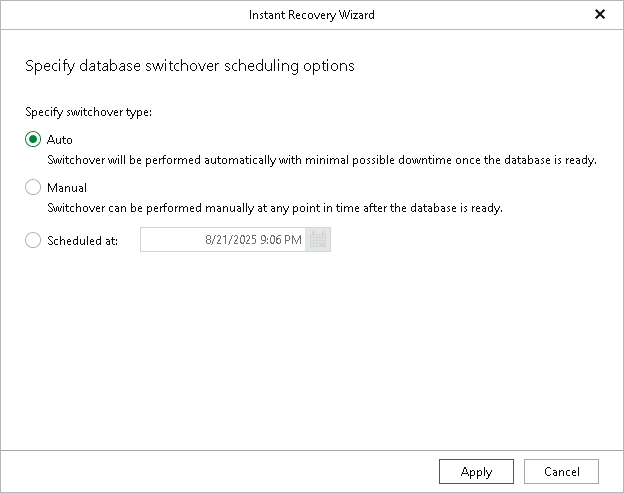

# Editing Instant Recovery Settings

In this article

If you have started an instant recovery session and want to change switchover settings, you can edit the instant recovery settings.

To change the switchover settings of an instant recovery session, do the following:

1. In the navigation pane, under the Instant Recovery node, select a published database.
2. On the Instant Recovery tab, select Edit or right-click the database or instance and select Edit.

1. Change the switchover option and click Apply.

Page updated 8/24/2025

Page content applies to build 13.0.1.1071
