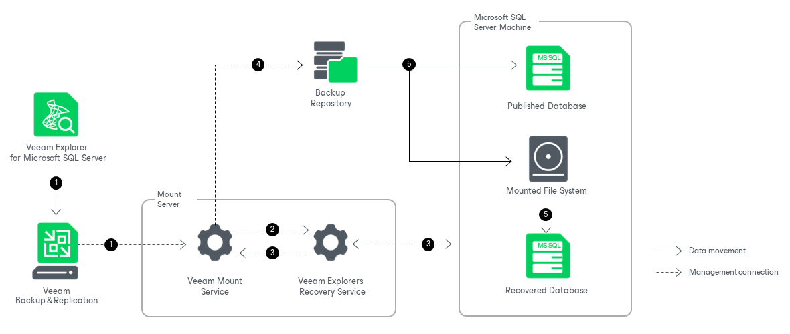

# How Instant Recovery Works

To perform instant recovery, Veeam Explorer for Microsoft SQL Server uses the Veeam Explorers Recovery Service running on the mount server associated with the backup repository. This removes the necessity to keep Veeam Explorer for Microsoft SQL Server running during an entire instant recovery session. Once the instant recovery session is started, you can close Veeam Explorer for Microsoft SQL Server and then open it later when necessary.

Instant recovery of Microsoft SQL Server databases works in the following manner:

1. To start the instant recovery process, Veeam Explorer for Microsoft SQL Server sends an instant recovery command to the Veeam Mount Service. The service runs on the mount server associated with the backup repository.
2. The Veeam Mount Service delegates this request to the Veeam Explorers Recovery Service running on the same server.
3. The Veeam Explorers Recovery Service connects to the target server and performs a series of validations. For example, it checks if the target server has enough available memory for the published and the recovered database.

To perform these validations and required file operations, the Veeam Explorers Recovery Service deploys persistent or runtime components on the target server and, if you recover your data up to a specific transaction, on the staging server. These components check the valid rights assignments required for database recovery, get information about the databases, and later perform required file operations including database and transaction logs copy. For more information, see [Deploying Persistent and Non-Persistent Components](vesql_restore_service.md).

1. The Veeam Explorers Recovery Service sends a request to the Veeam Mount Service to connect to the backup repository and initiate the mounting operations.
2. The Veeam Mount Service uses backup files to start 2 [iSCSI mount sessions](vesql_mount_operations.md) in parallel.

* The first session mounts the necessary file system from the backup repository to the C:\VeeamFLR directory on the target machine. The persistent or runtime components on the target server start the database from the mounted file system and attach it to the target Microsoft SQL Server instance. This iSCSI mount session is only stopped after the instant recovery session is canceled or switchover is performed.

All changes to the published database while it is online are saved in the instant recovery write cache, stored on the mount server. By default, the write cache is stored in the C:\ProgramData\Veeam\Backup\IRCache\ folder of the mount server. For more information on how to configure the write cache folder, see [Specify Mount Server Settings](repository_mount_server.md).

* The second session also mounts the file system to the C:\VeeamFLR directory on the target machine, but this session is used to copy the database from the mounted file system to the native file system of the target machine. This iSCSI mount session is stopped once the instant recovery session is canceled or all database files are copied to the target machine.

The persistent or runtime components use the write cache to synchronize the recovered database with the changes on the published database.

When performing instant recovery to a failover cluster, the file system is mounted to the C:\VeeamFLR directory of every node of the cluster. Note that each volume is also mounted as 2 separate drives, requiring 2 free drive letters.

After synchronization, you can switch over to the recovered database. For more information about the available switchover options, see [Switchover](vesql_switchover.md).

During switchover, the persistent or runtime components on the target server perform the following actions:

1. They stop the published database.
2. They use the write cache to synchronize differences between the published database and the recovered database.
3. They drop the published database.
4. They start the recovered database.

The instant recovery session is resilient to network disruption, backup server or mount server crashes. If anything disrupts the restore process, the restore process stays in the waiting mode and performs 10 automatic retries every 5 minutes. If the retries fail, you can launch retry after the server or network is up.

