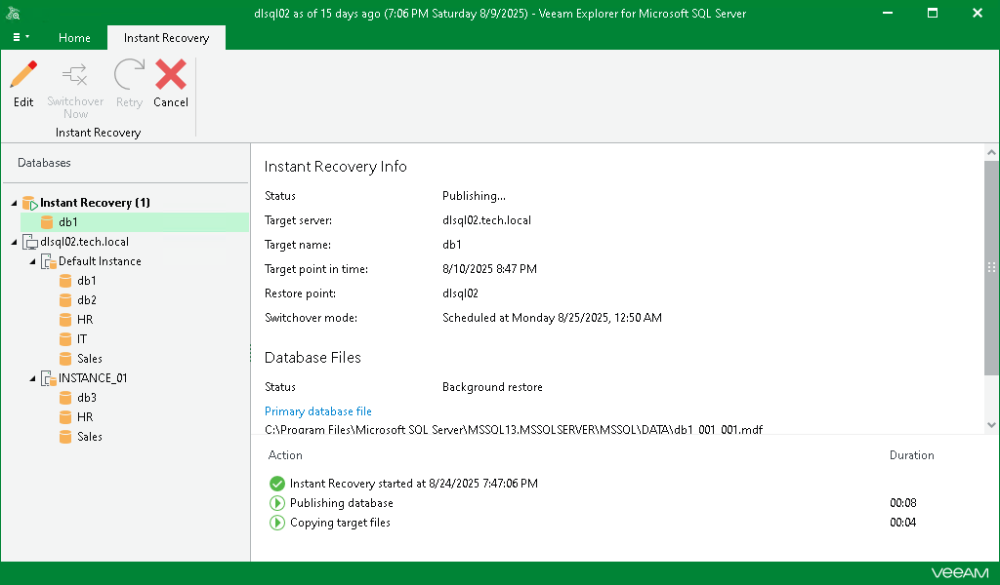

# Step 3. Finalize Instant Recovery Session

In this article

After you finish steps of the Instant Recovery wizard, Veeam Explorer for Microsoft SQL Server starts an instant recovery session.

In the Instant Recovery session view, you can see the progress of the recovery, edit switchover settings, cancel instant recovery, and start manual switchover (if you have selected the Manual switchover option in the Instant Recovery wizard).

Depending on the selected switchover option, switchover starts in one of the following ways:

* Automatically, immediately after synchronization
* Automatically, according to a specified schedule
* Manually

If you have selected the Manual switchover option, you must perform switchover manually as described in [Starting Switchover Manually](vesql_manual_switchover.md).

Related Topics

* [Managing Instant Recovery Session](vesql_instant_session.md)
* [Switchover](vesql_switchover.md)

Page updated 8/24/2025

Page content applies to build 13.0.1.1071
