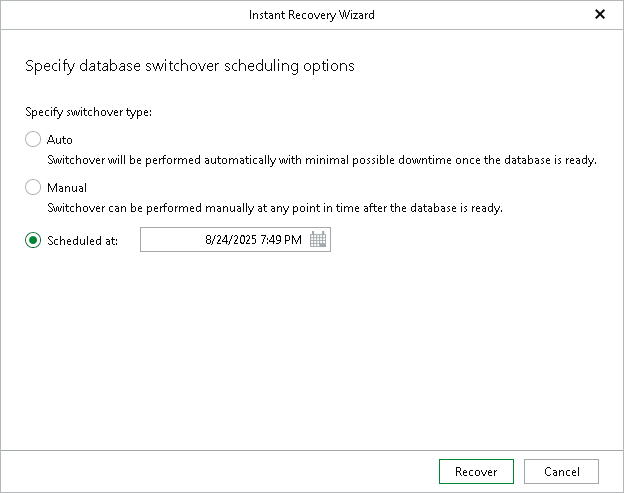

# Step 2. Specify Switchover Settings

At this step of the wizard, specify a database switchover type. During switchover, the mounted database is switched to its complete copy on the target server.

To select a switchover type and start an instant recovery session, do the following:

1. At the Specify switchover type field, select one of the following switchover options:

* Auto: switchover is performed automatically after all database files are copied and synchronized.
* Manual: switchover is started manually by user at any time after all database files are copied and synchronized.

* Scheduled: switchover is performed at a specified date and time. Use the drop-down calendar to specify the date and time.

1. Click Recover.

After you click Recover, Veeam Explorer for Microsoft SQL Server starts publishing the database on the target server.

|  |
| --- |
| Note |
| [For Linux-based backup servers] Before the restore process begins, you will be prompted to enter the source machine credentials. |

