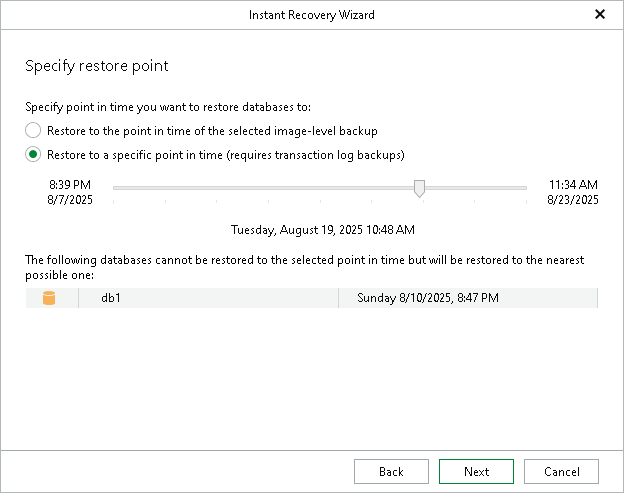

# Step 3. Specify Restore Point

At this step of the Instant Recovery wizard, select a state as of which you want to recover databases:

* Select the Restore to the point in time of the selected image-level backup option to load database files as of the moment when the current restore point was created.

* Select the Restore to a specific point in time option to load database files as of the selected point in time. Note that this option is available only if archived log backups exist. For more information, see [Required Job Settings](vesql_bu_job_settings.md).

Use the slider to choose the point in time you need.

If some of the databases do not have transaction log backups for the specified time, they will be displayed below with their own time point.

