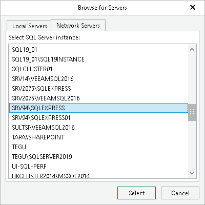

# Step 4. Specify Target Server

At this step of the wizard, specify credentials to access the target server.

1. In the Server name field, specify the target instance to which you want to restore the database. Use the <IP address\instance> or <hostname\instance> format. You can select an instance from the drop-down list or use the Browse button on the right.

To browse for another servers and SQL Server instances:

1. Click the Browse button.
2. You can select a SQL Server instance residing on the local machine on the Local Servers tab or click the Network Servers tab and select an instance on another server. Veeam Explorer for Microsoft SQL Server displays servers from your network where SQL Server is installed.

1. In the Specify user account to connect section, specify credentials which will be used to connect to the target SQL Server instance.

* Select the Use SQL Server authentication check box to use SQL Server authentication. If not selected, Veeam Explorer for Microsoft SQL Server will use Windows authentication.
* Make sure the account has been granted the sysadmin role privileges on a target SQL server.

