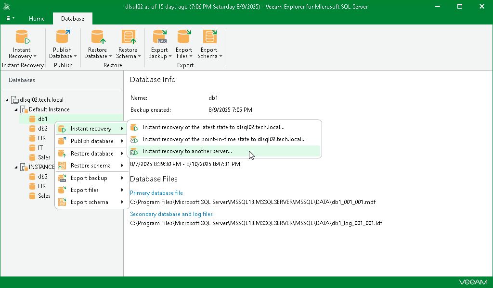

# Step 1. Launch Instant Recovery Wizard

In this article

To launch the Instant Recovery wizard, do the following:

1. In the navigation pane, select a database.
2. On the Database tab, select Instant Recovery > Instant recovery to another server.

Alternatively, you can right-click a database and select Instant recovery > Instant recovery to another server.

Page updated 8/24/2025

Page content applies to build 13.0.1.1071
