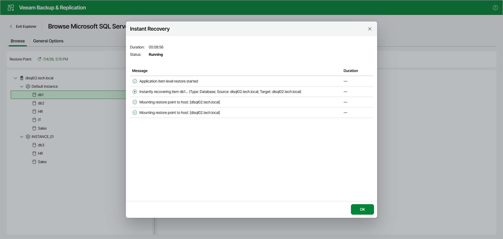
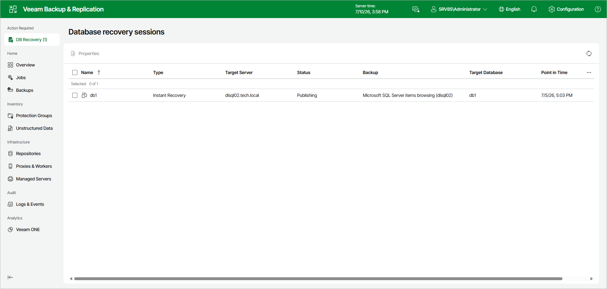

# Managing Instant Recovery Session

After you finish the steps of the Instant Recovery wizard, Veeam Explorer for Microsoft SQL Server starts an instant recovery session that shows the progress of the recovery process.

Note that clicking OK or closing the session window does not interrupt the operation.

You can manage and track the session progress in the Veeam Backup & Replication web UI.

To do this, open the Veeam Backup & Replication web UI and in the management pane, click DB Recovery.

In the Database recovery sessions view, you can find ongoing recovery sessions.

Depending on the option you choose in the Instant Recovery wizard, switchover starts in one of the following ways:

* Automatically, immediately after synchronization
* Automatically, according to a specified schedule
* Manually

If you have selected the Manual switchover option, you must perform switchover manually as described in [Starting Switchover Manually](vesql_ir_web_ui_switchover_manual.md).

|  |
| --- |
| The instant recovery session closes automatically after switchover. |

For ongoing instant recovery sessions, you can do the following:

* [View Instant Recovery session details](vesql_ir_web_ui_manage_properties.md).
* [Edit switchover settings](vesql_ir_web_ui_manage_edit.md).
* [Cancel instant recovery](vesql_ir_web_ui_manage_cancel.md).

Page updated 2026-07-10

