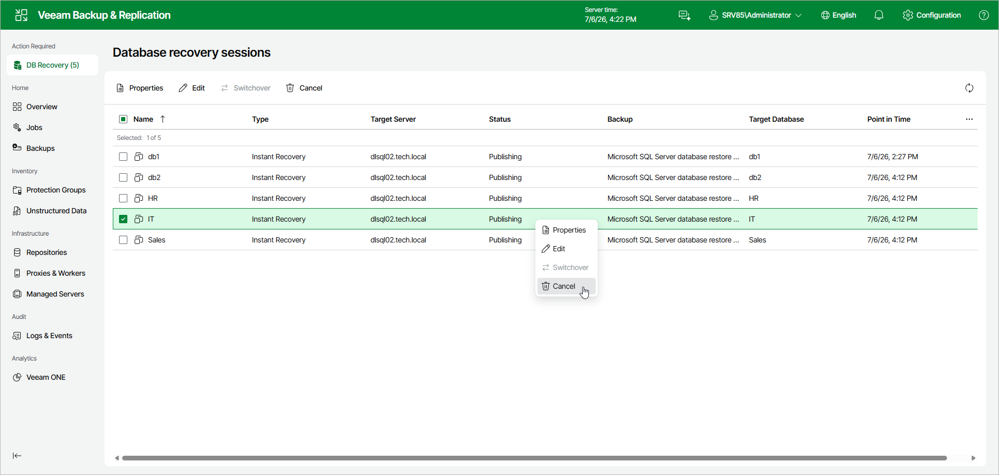

# Canceling Instant Recovery

If you have finished working with the published database and you do not want to switch over to it, you can cancel the instant recovery session.

|  |
| --- |
| Note |
| You do not need to cancel the instant recovery session if switchover is already performed. The session closes automatically after switchover. |

To cancel the instant recovery session, do the following:

1. In the Database recovery sessions view, select an instant recovery session.
2. Click Cancel.

Alternatively, right-click the session and select Cancel.

Page updated 2026-07-10

