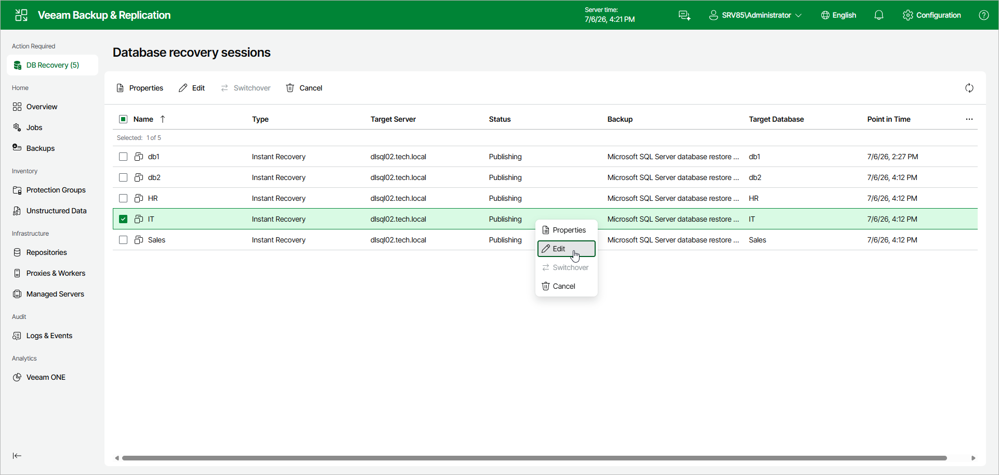
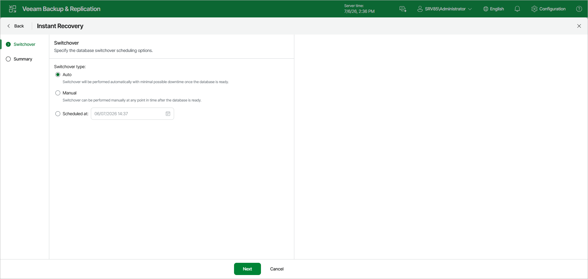
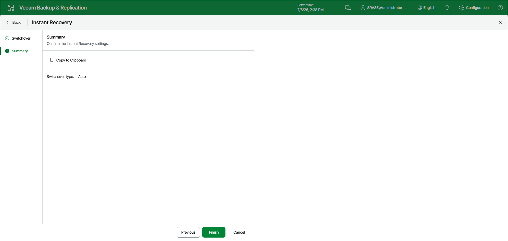

# Editing Instant Recovery Settings

If you have started an instant recovery session and want to change switchover settings, you can edit the instant recovery settings.

To change the switchover settings of an instant recovery session, do the following:

1. In the Database recovery sessions view, select an instant recovery session.
2. Click Edit.

Alternatively, you can right-click the session and select Edit.

1. In the Instant Recovery wizard, change the switchover type at the Switchover step.

Under Switchover type, select one of the following options:

* Auto: switchover is performed automatically with minimal possible downtime once the database is ready.
* Manual: switchover can be performed manually at any time after the database is ready.

* Scheduled at: switchover is performed at the specified date and time. Use the calendar to specify the date and time.

1. At the Summary step, review the switchover settings. To copy the summary to the clipboard, click Copy to Clipboard. To save the switchover settings, click Finish.

Page updated 2026-07-10

