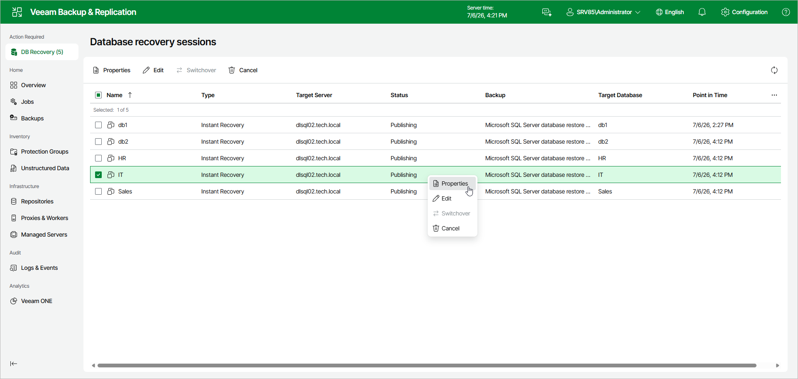

# Viewing Instant Recovery Session

To see details about the instant recovery session, do the following:

1. In the Database recovery sessions view, select an instant recovery session.
2. Click Properties.

Alternatively, you can right-click the session and click Properties.

Page updated 2026-07-10

