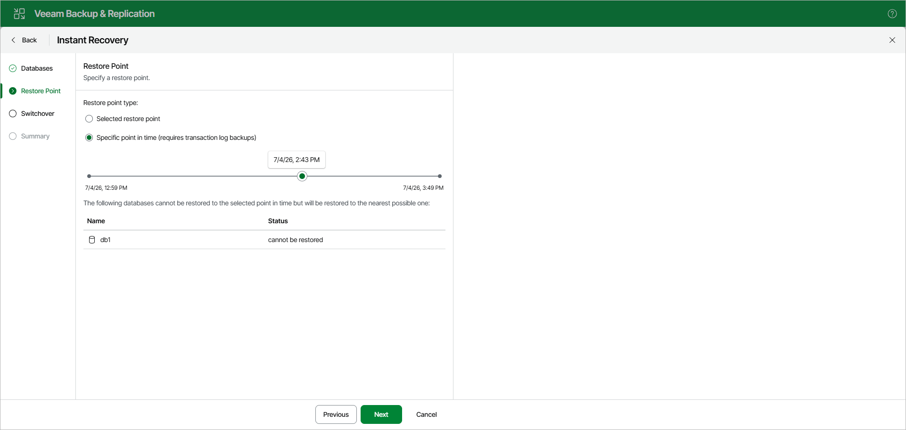

# Step 3. Specify Restore Point

At the Restore Point step, select a state as of which you want to recover databases:

* Select the Selected restore point option to load database files as of the moment when the current restore point was created.

* Select the Specific point in time option to load database files as of the selected point in time.

Use the slider to choose the point in time you need.

If the backed-up transaction logs do not contain information about some databases for the selected point in time, those databases will be recovered as of their latest available state.

Page updated 2026-07-07

