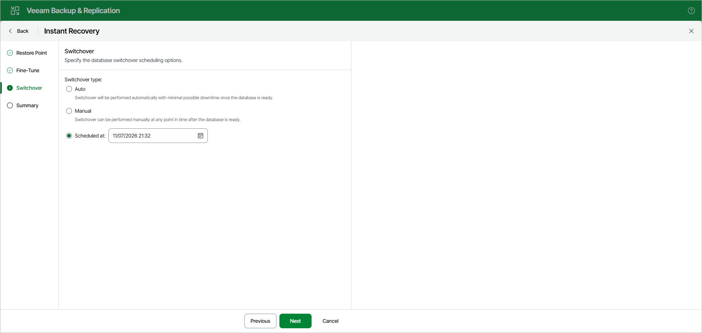

# Step 4. Specify Switchover Settings

At the Switchover step, specify a database switchover type. During switchover, the mounted database is switched to its complete copy on the target server.

Under Switchover type, select one of the following options:

* Auto: switchover is performed automatically with minimal possible downtime once the database is ready.
* Manual: switchover can be performed manually at any time after the database is ready.

* Scheduled at: switchover is performed at the specified date and time. Use the calendar to specify the date and time.

Page updated 2026-07-11

