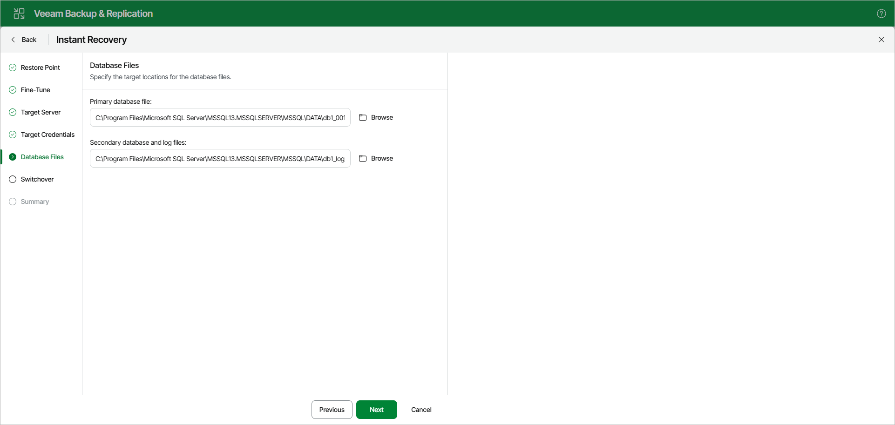

# Step 5. Specify Database File Location

At the Database Files step, specify the location for database files (control files, data files, log files and temp files).

To edit the path, click the path row and specify the location you want to use. If specified folders do not exist, Veeam Explorer for Microsoft SQL Server will create these folders.

Alternatively, click Browse to manually select the destination folder from the directory structure of the target server.

Page updated 2026-07-07

