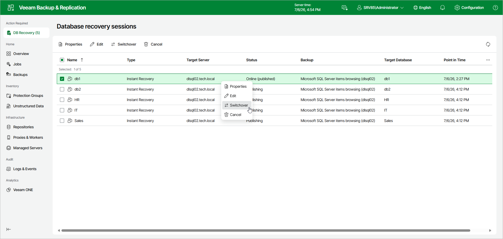

# Starting Switchover Manually

If you have selected the Manual switchover option in the Instant Recovery wizard, you can start the switchover process at any time if the database is in the Online (published) state.

To start switchover manually, do the following:

1. In the Database recovery sessions view, select an instant recovery session.
2. Click Switchover.

Alternatively, right-click the session and select Switchover.

Page updated 2026-07-07

